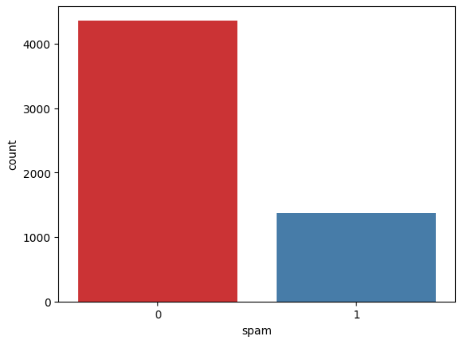
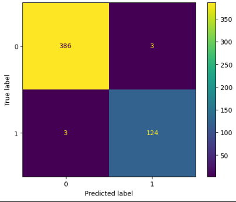
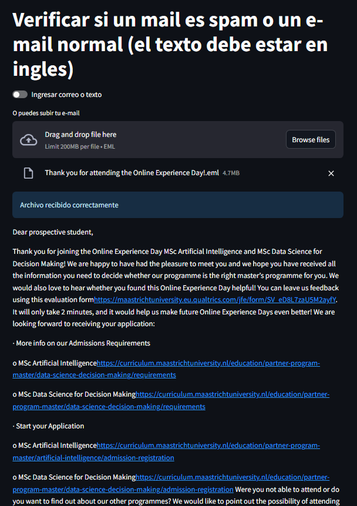

# Spam-mail-detection
Naive Bayes model to detect spam email. Streamlit application using the pretrained model

Dataset

For the initial dataset, aproximately 5700 randomly emails were evaluated. Dataset was pulled from the following github: https://github.com/hnawaz007/pythondataanalysis/tree/main/ML/data

This dataset only contained 2 columns for the text and the label stating if the e-mail was an spam or not.

The following image shows how the dataset looks as an example:

Also the distribution of the dataset is as follows:

Preprocesing

The dataset did not contained any null values, so we did not need to deal with that. 

But, as it can be seen in the example, the dataset contains the "Subject:" text in all the mails. So we need to delete that so it would not affect the training. 

Training

We would be using the Naive Bayes model, this is specially usefull as it accounts for the word frecuency and uses it to calculate the probability for the e-mail to be considered as an spam.

Also, in order to convert the text into numerical values that can be used for the model. Also, the Count Vectorizer would take the frecuency in which the words appear in each e-mail. 
For the vocabulary, only the train part of the dataset would be used so it wont affect the training and cause overfitting.

The dataset was splitted in 70% training, 20% test and 10% validation

Results

Using this approach we got a 99% accuracy in the validation part of the dataset.

Application

After we train the model, we can deploy an application using stream lit which would allow us to introduce manual text or upload an e-mail file to the application so the classiffier can determinate if its an spam or not.

Note: Comments in the dataset are in Spanish as it is my native language
